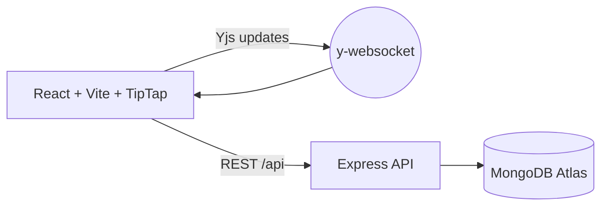

# DocumentEditor

Clean, black‑and‑white collaborative editor with autosave and real‑time syncing. Designed for a focused writing experience and dependable production use.

## Highlights

- **Autosave every 3 seconds** to MongoDB
- **Real‑time collaboration** via Yjs + y‑websocket
- **Minimal UI**: “DocumentEditor” heading, monochrome theme, essential toolbar (Bold, Italic, H2, Underline, Align, Lists, Quote, Code, Clear, Undo/Redo)
- **Stable backend** with strict env‑based DB credentials (no hardcoded secrets)
- **Ready for deployment** (Render for server; any static host for client)

## Tech Stack

- **Frontend**: React, Vite, TypeScript, TipTap (ProseMirror)
- **Collaboration**: Yjs, y‑websocket
- **Backend**: Node.js, Express, TypeScript
- **Database**: MongoDB Atlas (Mongoose)
- **Deployment**: Render (server), GitHub (code), optional Netlify/Vercel (client)

## Architecture Overview

- Client connects to the backend for:
  - REST persistence: `GET/PUT /api/documents/:key`
  - WebSocket sync: y‑websocket mounted on the same server
- Backend connects to MongoDB using `MONGODB_URI` (required at runtime)
- Client chooses endpoints via environment variables for hosted environments

```
React (TipTap) ——REST——> Express ————> MongoDB Atlas
           └—WebSocket—> y-websocket
```

### Diagram



### Components

- **Client (React + TipTap)**
  - Editor UI and toolbar (bold, italic, headings, lists, quote, code, align, clear, undo/redo)
  - Autosave timer (3s) triggers persistence
  - Chooses API/WS base via env (`VITE_API_URL`, `VITE_WS_URL`) or localhost fallback

- **Backend (Express + y-websocket)**
  - REST routes under `/api/documents/:key`
  - WebSocket server for Yjs collaborative updates (same process)
  - Connects to MongoDB via Mongoose

- **Database (MongoDB Atlas)**
  - Stores normalized document JSON (TipTap/ProseMirror doc schema)

### Data Model

- `Document` collection
  - `key: string` (unique identifier, e.g., `doc-1`)
  - `content: object` (TipTap JSON)
  - `updatedAt: Date` (auto-updated)

### Key Flows

1) Load Document
   - Client `GET /api/documents/:key`
   - If found, sets editor content; otherwise starts with empty doc

2) Autosave (every 3s)
   - Client collects editor JSON and `PUT /api/documents/:key` with `{ content }`
   - Server upserts document and updates `updatedAt`

3) Collaboration
   - Client connects to WebSocket (Yjs provider)
   - Peer updates merge CRDT state; editor reflects changes live

4) Fallback (Static Hosting)
   - If `VITE_API_URL` is not set and host is GitHub Pages, client safely disables API/WS and avoids errors

## Real‑time & Persistence

- Collaboration powered by Yjs; editor state shared over WebSocket
- Autosave tick (3s) persists the current document JSON to MongoDB
- Safe on slow networks: failed autosave attempts are retried in the next tick

## Production Deployment

- Backend (Render)
  - `render.yaml` provided
  - Set environment variable: `MONGODB_URI`
  - Render exposes `PORT` automatically (Express uses it)
- Frontend (Netlify/Vercel/etc.)
  - Set env vars to point to your backend:
    - `VITE_API_URL = https://<your-render-app>.onrender.com`
    - `VITE_WS_URL  = wss://<your-render-app>.onrender.com`
  - Build and deploy as a static site

### Deployment Diagram

```mermaid
flowchart LR
  U[User Browser] --> F[Frontend (Netlify/Vercel)]
  F -->|VITE_API_URL| S[Backend (Render)]
  F -->|VITE_WS_URL| S
  S --> M[(MongoDB Atlas)]
```

### Environment Variables

- Server (Render or local `.env`)
  - `MONGODB_URI` (required)
  - `PORT` (Render provides automatically; locally default 4000)

- Client (Netlify/Vercel or `.env` during build)
  - `VITE_API_URL` (optional; if missing, localhost or static fallback)
  - `VITE_WS_URL`  (optional; if missing, localhost or static fallback)

## Local Development

- Server
  - Copy `server/.env.example` to `server/.env`
  - Set `MONGODB_URI` (MongoDB Atlas URI)
  - Install: `npm --prefix server install`
  - Run: `npm --prefix server run dev` (http://localhost:4000)
- Client
  - Install: `npm --prefix client install`
  - Run: `npm --prefix client run dev` (http://localhost:5175)

## API Endpoints (Documents)

- `GET    /api/documents/:key`
- `PUT    /api/documents/:key`  body: `{ content: TipTapJSON }`

## Security & Reliability

- No hardcoded DB secrets; `MONGODB_URI` must be provided via environment variables
- Mongoose strictQuery enabled
- Graceful behavior if backend is unavailable in static hosting (client avoids crashing)

### Scalability & Ops

- Horizontal scaling:
  - Stateless Express can scale behind a load balancer
  - Use a sticky session or a shared y-websocket awareness layer (e.g., Redis) for multi‑instance realtime
- Persistence:
  - MongoDB Atlas handles replication; choose an M10+ tier for production
- Observability:
  - Add request logging (morgan) and metrics if needed (Prometheus/OpenTelemetry)
- Backups:
  - Enable MongoDB Atlas backups for compliance and DR

### Troubleshooting

- Cannot connect to DB on Render:
  - Verify `MONGODB_URI` is set and IP access list allows Render egress
- Client shows no realtime:
  - Ensure `VITE_WS_URL` is wss://<render-app>
- Autosave not persisting:
  - Check REST calls in devtools; server logs; ensure `content` is valid JSON

## My Role & Skills Demonstrated

- **Full‑stack engineering**: React + TipTap on the client; Node/Express on the server
- **Real‑time systems**: Integrated Yjs and y‑websocket for collaborative editing
- **Data modeling & persistence**: MongoDB (Mongoose) schemas and autosave strategy
- **DevOps & deployment**: Render provisioning via `render.yaml`; environment‑based config
- **DX and maintainability**: Minimal UI; strict separation of concerns; safe env handling; readable codebase

## Extend / Future Work

- Add more TipTap extensions (tables, images)
- Implement auth and sharing/permissions
- Document list, version history
- CI for lint/build and automated deploys

---

For deployment support or customization, open an issue or reach out.

## Project Structure

```
DocumentEditor/
├─ client/
│  ├─ index.html
│  ├─ package.json
│  ├─ vite.config.ts
│  └─ src/
│     ├─ App.tsx              # Editor UI and toolbar
│     ├─ api.ts               # REST calls (load/save)
│     ├─ config.ts            # API/WS endpoint resolution
│     ├─ main.tsx             # React entry
│     └─ index.css            # Base styles
│
├─ server/
│  ├─ package.json
│  ├─ tsconfig.json
│  └─ src/
│     ├─ index.ts             # Express app + y-websocket
│     ├─ db.ts                # Mongoose connection
│     ├─ realtime.ts          # WebSocket bootstrap
│     ├─ routes/
│     │  └─ documents.ts      # GET/PUT /api/documents/:key
│     └─ models/
│        ├─ Document.ts       # Document schema
│        └─ YDocState.ts      # (optional) yjs doc model
│
├─ render.yaml                # Render deployment config (server)
└─ README.md
```

## Detailed Flows

- **Request lifecycle (save)**
  - Editor JSON → `PUT /api/documents/:key` → Express → Mongoose → MongoDB
  - Response 200 → UI remains responsive; next autosave scheduled in 3s

- **Request lifecycle (load)**
  - `GET /api/documents/:key` → returns `{ key, content }` or 404 → client falls back to empty doc

- **Collaboration (Yjs)**
  - Client opens WS to `WS_URL` → joins room `doc-1`
  - Local changes broadcast as CRDT updates → other peers merge → editor reflects

## Configuration Matrix

- Localhost (default)
  - API: `http://localhost:4000`
  - WS:  `ws://localhost:4000`

- Hosted (Render + Netlify/Vercel)
  - Set in frontend env at build time:
    - `VITE_API_URL=https://<render-app>.onrender.com`
    - `VITE_WS_URL=wss://<render-app>.onrender.com`

## Scripts

- Server
  - `npm --prefix server install`
  - `npm --prefix server run dev`
  - `npm --prefix server run build && npm --prefix server run start`

- Client
  - `npm --prefix client install`
  - `npm --prefix client run dev`
  - `npm --prefix client run build && npm --prefix client run preview`

## Testing (suggested)

- Unit: TipTap commands and reducers (Vitest/Jest)
- API: Supertest for `/api/documents/:key`
- E2E: Playwright/Cypress to validate autosave + realtime with two browsers

## Performance Notes

- TipTap document size kept lean; autosave interval is 3s (tunable)
- Rollup code‑splitting configured in `vite.config.ts`
- Consider CDN for static assets when hosting at scale

## Accessibility

- High contrast monochrome palette
- Buttons operable via keyboard (Enter/Space)
- Headings and controls use semantic markup

## Roadmap

- Multi‑document list and share links
- Auth (private docs, roles)
- Presence cursors and user colors
- Version history and restore

